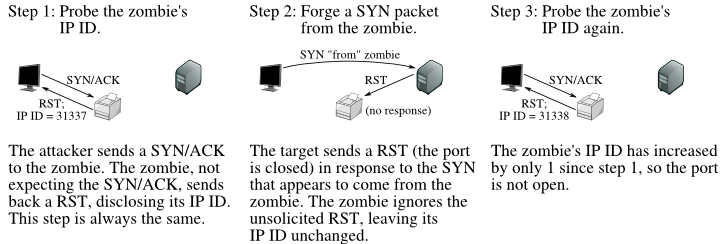

# Enumeration and IDS Evading

## Host Discovering (AKA know who is in your net)

There are many options `Nmap` provides to determine whether our target is alive or not. The most effective host discovery method is to use **ICMP echo requests**, which we will look into. For example to detertmine wich hosts are alive in your net you could use the next command:

`sudo nmap -sn -oN scan.txt 10.10.10.10/24`

`-sn` - Disable por scanning since we only want to know if a host is up or not

`-oN` - Form of the putput file

If for example you had some list of IP’s you wanted to check you could use the `-iL` flag to test multiple IP’s stored in a file. Ex:

`sudo nmap -sn -oN scan.txt -iL IPs.txt`

You can also scan multiple IP’s at once if you wanted to:

`sudo nmap -sn -oN scan.txt 10.10.10.1 10.10.10.2 10.10.10.3` or `sudo nmap -sn -oN scan.txt 10.10.10.1-3`

If we disable port scan (`-sn`), Nmap automatically ping scan with `ICMP Echo Requests` (`-PE`). Once such a request is sent, we usually expect an `ICMP reply` if the pinging host is alive. The more interesting fact is that our previous scans did not do that because before Nmap could send an ICMP echo request, it would send an `ARP ping` resulting in an `ARP reply`. We can confirm this with the "`--packet-trace`" option. To ensure that ICMP echo requests are sent, we also define the option (`-PE`) for this.

To also know why it is marking it as alive we can use the flag `--reason` . If we use this we can quickly notice that the reason of nmap marking a host alive for default is that when it sends an ARP packet if recieves an ARP reply.

`Host is up, received arp-response (0.012s latency).`

To disable ARP sending messages we can use the flag `--disable-arp-ping`

## **Host and Port Scanning**

So first before making port reconoisncese we have to know what the results that we may get mean. So for ports there are 6 possible states.

| State      | Description                                                                                                                                                                                                                                      |
| ---------- | ------------------------------------------------------------------------------------------------------------------------------------------------------------------------------------------------------------------------------------------------ |
| open       | This means that we established a connection succesfully. These connections can be TCP, UDP as well as SCTP associations.                                                                                                                         |
| closed     | When we see this it means that the TCP protocol indicates that we recieved a RST package.                                                                                                                                                        |
| filtered   | This means that we got no response. We’re on seen sadly.                                                                                                                                                                                         |
| unfiltered | This happens when we send TCP-ACK flag packet, we actually can reach the host (This is not the same ad the filtered state since or packets did not get dropped by a firewall and we actually were able to reach the host) but we get no response |
| open       | filtered                                                                                                                                                                                                                                         |
| closed     | filtered                                                                                                                                                                                                                                         |


<figure><figcaption></figcaption></figure>

**Connect scan**

We can use `-sS` which is a fast scan since we only want to send SYN packet and wait to see if we get a SYN-ACK packet. Also we can use a full TCP connection and the RST this with the flag `-sT` this will be a lot slower but in some cases will be better since we act as a normal user

Another option (`--stats-every=5s`) that we can use is defining how periods of time the status should be shown. Here we can specify the number of seconds (`s`) or minutes (`m`), after which we want to get the status.

## **Nmap Scripting Engine (NSE)**

Nmap Scripting Engine (`NSE`) is another handy feature of `Nmap`. It provides us with the possibility to create scripts in Lua for interaction with certain services. There are a total of 14 categories into which these scripts can be divided:

| Category  | Description                                                                                                                                                                                                                                                                                                                                                                                                                                                                                      |
| --------- | ------------------------------------------------------------------------------------------------------------------------------------------------------------------------------------------------------------------------------------------------------------------------------------------------------------------------------------------------------------------------------------------------------------------------------------------------------------------------------------------------ |
| auth      | Determination of authentication credentials.                                                                                                                                                                                                                                                                                                                                                                                                                                                     |
| broadcast | Scripts, which are used for host discovery by broadcasting and the discovered hosts, can be automatically added to the remaining scans.                                                                                                                                                                                                                                                                                                                                                          |
| brute     | Executes scripts that try to log in to the respective service by brute-forcing with credentials.                                                                                                                                                                                                                                                                                                                                                                                                 |
| default   | Run the default scripts, same as `-sC`                                                                                                                                                                                                                                                                                                                                                                                                                                                           |
| discovery | These scripts try to actively discover more about the network by querying public registries, SNMP-enabled devices, directory services, and the like. Examples include `html-title` (obtains the title of the root path of web sites), `smb-enum-shares` (enumerates Windows shares), and `snmp-sysdescr` (extracts system details via SNMP).                                                                                                                                                     |
| dos       | Denial of service                                                                                                                                                                                                                                                                                                                                                                                                                                                                                |
| exploit   | These scripts aim to actively exploit some vulnerability.                                                                                                                                                                                                                                                                                                                                                                                                                                        |
| external  | Scripts in this category may send data to a third-party database or other network resource. An example of this is `whois-ip`, which makes a connection to whois servers to learn about the address of the target.                                                                                                                                                                                                                                                                                |
| fuzzer    | This category contains scripts which are designed to send server software unexpected or randomized fields in each packet. While this technique can useful for finding undiscovered bugs and vulnerabilities in software, it is both a slow process and bandwidth intensive. An example of a script in this category is `dns-fuzz`, which bombards a DNS server with slightly flawed domain requests until either the server crashes or a user specified time limit elapses.                      |
| intrusive | These are scripts that cannot be classified in the `safe` category because the risks are too high that they will crash the target system, use up significant resources on the target host (such as bandwidth or CPU time), or otherwise be perceived as malicious by the target's system administrators.                                                                                                                                                                                         |
| malware   | These scripts test whether the target platform is infected by malware or backdoors. Examples include `smtp-strangeport`, which watches for SMTP servers running on unusual port numbers, and `auth-spoof`, which detects identd spoofing daemons which provide a fake answer before even receiving a query. Both of these behaviors are commonly associated with malware infections.                                                                                                             |
| safe      | Scripts which weren't designed to crash services, use large amounts of network bandwidth or other resources, or exploit security holes are categorized as `safe`. These are less likely to offend remote administrators, though (as with all other Nmap features) we cannot guarantee that they won't ever cause adverse reactions. Most of these perform general network discovery. Examples are `ssh-hostkey` (retrieves an SSH host key) and `html-title` (grabs the title from a web page).  |
| version   | Same as `-sV`                                                                                                                                                                                                                                                                                                                                                                                                                                                                                    |
| vuln      | These scripts check for specific known vulnerabilities and generally only report results if they are found. Examples include `realvnc-auth-bypass` and `afp-path-vuln`.                                                                                                                                                                                                                                                                                                                          |

If you want to use any of this categories you have to type the next command

`sudo nmap <TARGET> --script <CATEGORY>`

Or maybe if you want to run specific scripts use the following command:

`sudo nmap <TARGET> --script <script-name>,<script-name>..<>`

## **The `-A` scan**

Using this flag is like you use this `-sVOS --traceroute` , its very agressive and should not be used generally (Its actually really useful for machines where we are allowed to scan as HTB machines)

## Performance

Scanning performance plays a significant role when we need to scan an extensive network or are dealing with low network bandwidth. We can use various options to tell `Nmap` how fast (`-T <0-5>`), with which frequency (`--min-parallelism <number>`), which timeouts (`--max-rtt-timeout <time>`) the test packets should have, how many packets should be sent simultaneously (`--min-rate <number>`), and with the number of retries (`--max-retries <number>`) for the scanned ports the targets should be scanned.

So first of all we can take a look at the timeouts options that we have for optimizing our scans. This means that we can controll how much time after sending a packet we want to wait for a response. There are two flags: `--min-rtt-timeout 50ms` and `--max-rtt-timeout 100ms`

We can also modify the number of max retries we send. The default value is 10 but we can change it to 0 with `--max-retries 0` .This means that if nmap does not get a response for a sent packed it wont try again and it will skip the port.

If we are allowed to scan in a place and we want to test also how the net reacts to a heavy band-width usage we can use the flag `--min-rate <number>` which will accelerate a lot our scan too.

Because such settings cannot always be optimized manually, as in a black-box penetration test, `Nmap` offers six different timing templates (`-T <0-5>`) for us to use. These values (`0-5`) determine the aggressiveness of our scans. This can also have negative effects if the scan is too aggressive, and security systems may block us due to the produced network traffic. The default timing template used when we have defined nothing else is the normal (`-T 3`). If you want to see which are the default values for any of this options you can check [this link](https://nmap.org/book/performance-timing-templates.html)

## IPS and IDS evasion

Nmap TCP ACK scan (`-sA`) is a lot harder for IDS/IPS to filter since we are not asking to establish a connection (like with `-sS`), we are acting like we alreay have one and for the firewall is hard to tell if our ACK packet is comming from the external network or the internal.

Lets take a look to the ACADEMY example of this:

`-sS` scan:

```bash
mucleck2@htb[/htb]$ sudo nmap 10.129.2.28 -p 21,22,25 -sS -Pn -n --disable-arp-ping --packet-trace

Starting Nmap 7.80 ( https://nmap.org ) at 2020-06-21 14:56 CEST
SENT (0.0278s) TCP 10.10.14.2:57347 > 10.129.2.28:22 S ttl=53 id=22412 iplen=44  seq=4092255222 win=1024 <mss 1460>
SENT (0.0278s) TCP 10.10.14.2:57347 > 10.129.2.28:25 S ttl=50 id=62291 iplen=44  seq=4092255222 win=1024 <mss 1460>
SENT (0.0278s) TCP 10.10.14.2:57347 > 10.129.2.28:21 S ttl=58 id=38696 iplen=44  seq=4092255222 win=1024 <mss 1460>
RCVD (0.0329s) ICMP [10.129.2.28 > 10.10.14.2 Port 21 unreachable (type=3/code=3) ] IP [ttl=64 id=40884 iplen=72 ]
RCVD (0.0341s) TCP 10.129.2.28:22 > 10.10.14.2:57347 SA ttl=64 id=0 iplen=44  seq=1153454414 win=64240 <mss 1460>
RCVD (1.0386s) TCP 10.129.2.28:22 > 10.10.14.2:57347 SA ttl=64 id=0 iplen=44  seq=1153454414 win=64240 <mss 1460>
SENT (1.1366s) TCP 10.10.14.2:57348 > 10.129.2.28:25 S ttl=44 id=6796 iplen=44  seq=4092320759 win=1024 <mss 1460>
Nmap scan report for 10.129.2.28
Host is up (0.0053s latency).

PORT   STATE    SERVICE
21/tcp filtered ftp
22/tcp open     ssh
25/tcp filtered smtp
MAC Address: DE:AD:00:00:BE:EF (Intel Corporate)

Nmap done: 1 IP address (1 host up) scanned in 0.07 seconds
```

So lets check whats happening here. We see that we are sending SYN flagged packets (They appear with an `S`) and we actually only recieved 2. So for port 21 we got an answer saying this port is unreachable so for some reason we cannot get to it but is not clear that is a firewall. For port 22 we get a SYN-ACK packet since this one is open and for the 25 we got no answer so we dont know very well what happening here too.

`-sA` scan:

```bash
mucleck2@htb[/htb]$ sudo nmap 10.129.2.28 -p 21,22,25 -sA -Pn -n --disable-arp-ping --packet-trace

Starting Nmap 7.80 ( https://nmap.org ) at 2020-06-21 14:57 CEST
SENT (0.0422s) TCP 10.10.14.2:49343 > 10.129.2.28:21 A ttl=49 id=12381 iplen=40  seq=0 win=1024
SENT (0.0423s) TCP 10.10.14.2:49343 > 10.129.2.28:22 A ttl=41 id=5146 iplen=40  seq=0 win=1024
SENT (0.0423s) TCP 10.10.14.2:49343 > 10.129.2.28:25 A ttl=49 id=5800 iplen=40  seq=0 win=1024
RCVD (0.1252s) ICMP [10.129.2.28 > 10.10.14.2 Port 21 unreachable (type=3/code=3) ] IP [ttl=64 id=55628 iplen=68 ]
RCVD (0.1268s) TCP 10.129.2.28:22 > 10.10.14.2:49343 R ttl=64 id=0 iplen=40  seq=1660784500 win=0
SENT (1.3837s) TCP 10.10.14.2:49344 > 10.129.2.28:25 A ttl=59 id=21915 iplen=40  seq=0 win=1024
Nmap scan report for 10.129.2.28
Host is up (0.083s latency).

PORT   STATE      SERVICE
21/tcp filtered   ftp
22/tcp unfiltered ssh
25/tcp filtered   smtp
MAC Address: DE:AD:00:00:BE:EF (Intel Corporate)

Nmap done: 1 IP address (1 host up) scanned in 0.15 seconds
```

Almost the same answer with this scan right? Lets take a closer look to find some things. So now we are sending ACK packets (they appear as `A`) and we got the same answer for port 21 which is not very clarifying. For port 22 we get a RST packet indicating the port is open and for the port 25 since we did not get any response we can assume our packets are getting dropped by a firewall in this one. So we actually detected a kind of firewall here just by looking deep at what is happening.

## Decoys

The first measure that those systems actually make is blocking our IP and if any packet is detected to come with our signatura(AKA IP) they will block it. For this cases we have the Decoy method `-D` .Nmap can generate different ips so we can evade getting blocked by the IPS. Here is an example of a command using this:

`sudo nmap -A <IP> -D RND:<NUMBER OF RANDOM IPS TO GENERATE>`

We can also determine where we want to simulate our packets are comming from with `-S` option

`sudo nmap -A <IP> -S 10.10.10.0 -e tun0` the `-e tun0` flag is because we have to specify the interface we are using.

## DNS Proxying

\[SEARCH WHAT DNS PROXYING MEANS IN A DMZ]

You can also change the source port of your scan with the flag `--source-port` to a port that is commonly used for DNS features and its usually trusted by firewalls.

Now that we have found out that the firewall accepts `TCP port 53`, it is very likely that IDS/IPS filters might also be configured much weaker than others. We can test this by trying to connect to this port by using `Netcat`. `ncat -nv --source-port 53 IP PORT`
